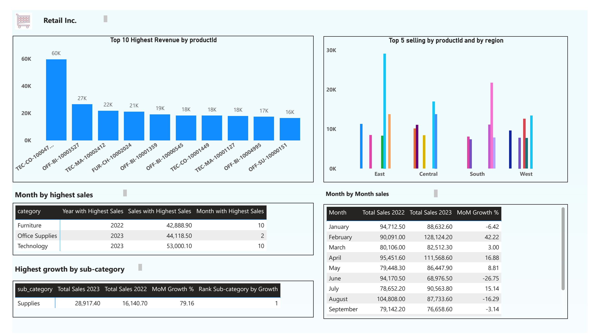

# Project ETL => Python & SQL & PowerBI

- End-to-End Data Pipeline: Developed an ETL pipeline that automated data extraction from Kaggle API using Python (Pandas, Jupyter, Zipfile), ensuring seamless data processing from raw to final output.
- Data Processing & Transformation: Cleaned, transformed, and processed large datasets in Python, optimizing data for storage in SQL Server and ensuring integrity for analysis.
- SQL Server Integration: Implemented a robust database architecture in SQL Server, efficiently managing data storage and querying for performance optimization.
- Data Visualization in Power BI: Created interactive Power BI dashboards to visualize key insights, enabling stakeholders to analyze trends, KPIs, and other metrics in real time.

## Requirements

--Check the requirements.txt file(include)

## Installation

1. Clone the repository:
   ```bash
   git clone link 

or 
Download the file


